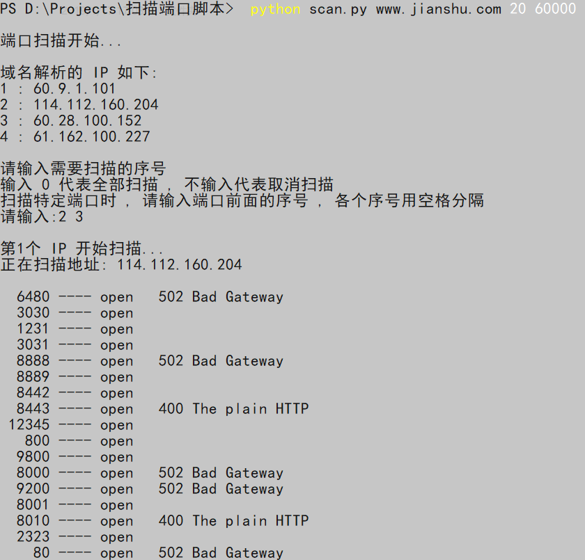
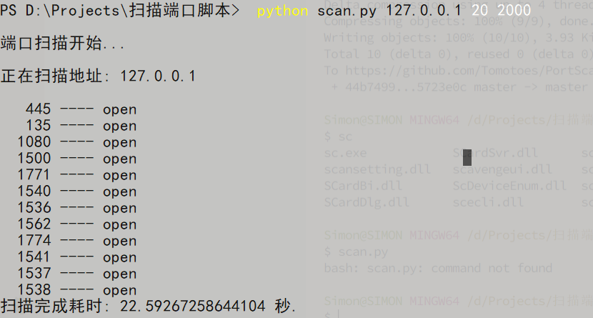

# PortScanner

## 介绍

一个集 多线程快速扫描端口，采集 `banner` ，DNS 解析循环扫描端口工具

借鉴于 [se55i0n](https://github.com/se55i0n/PortScanner)


## 用法

```python
python path/scan.py IP/Domain startPort endPort
```


## 快照





