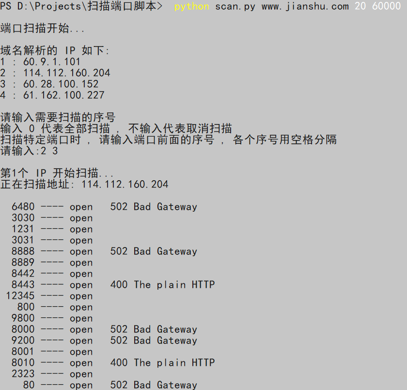
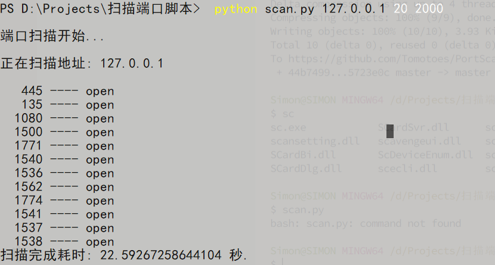

# PortScanner

[](https://cdn.jsdelivr.net/gh/Tomotoes/images/blog/wechat.png) [](https://cdn.jsdelivr.net/gh/Tomotoes/images/blog/alipay.png)


## 💡简介

一个集 多线程快速扫描端口，采集 `banner` ，DNS 解析循环扫描端口工具


## ✨使用

```python
python path/scan.py IP/Domain startPort endPort
```


## 🎉截图







## 🌞协议

无
